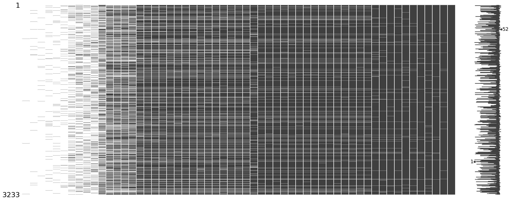
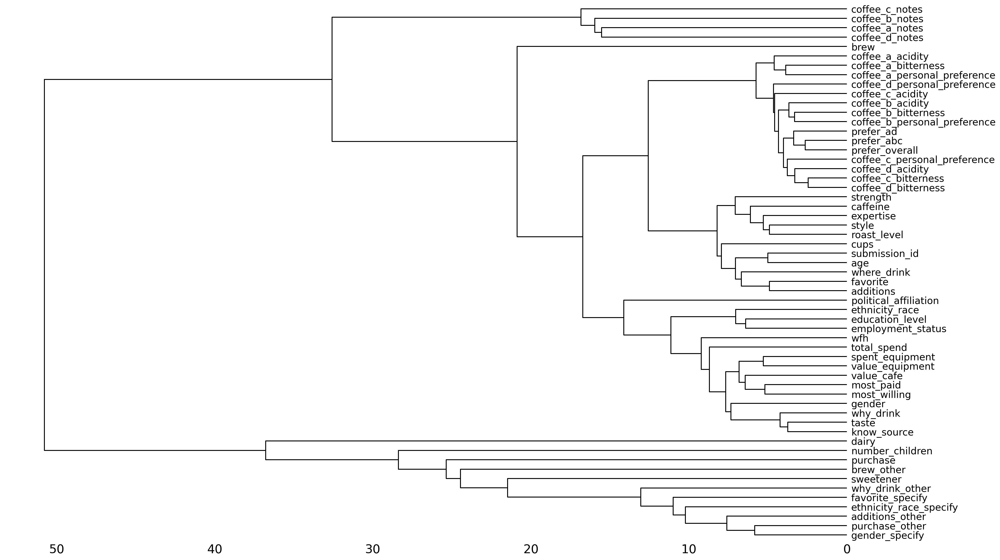
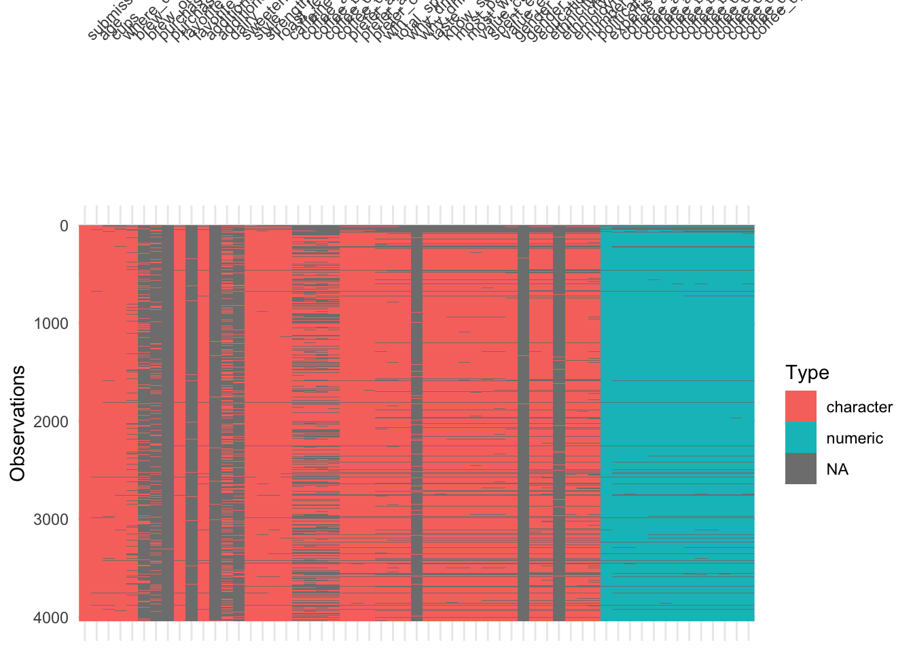
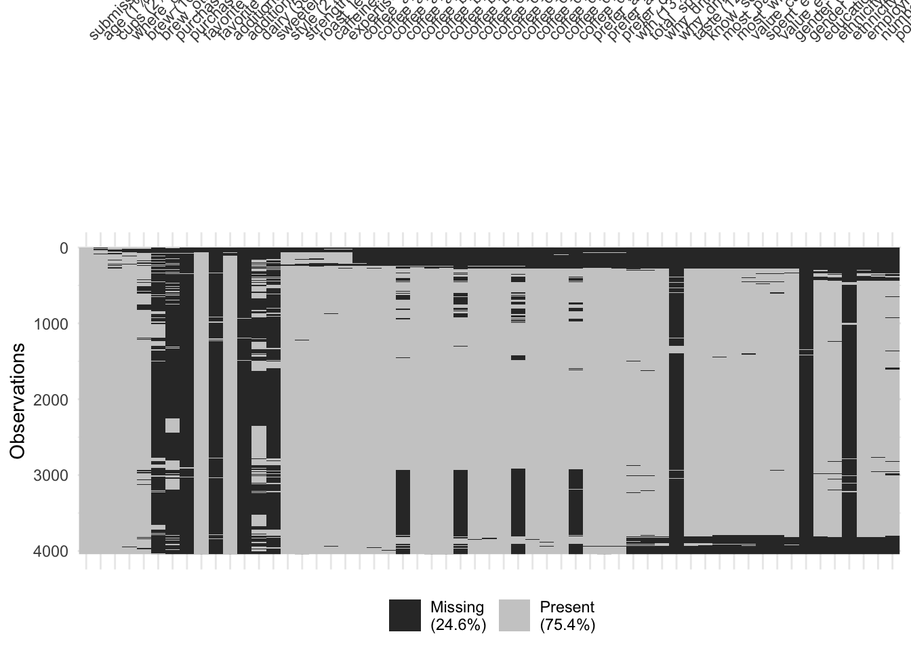

# AE-09: Feature Engineering — Coffee EDA

**Course:** INFO 4940/5940 — Applied Machine Learning, Fall 2025
[View HTML (R)](ae-09-eda-coffee-r.html) | [View HTML (Python)](ae-09-eda-coffee-py.html)

---

## The Goal

Exploratory data analysis on the Great American Coffee Taste Test dataset — the same data used for HW-04. The mission here was to understand the structure, missingness, and outlier patterns before any modeling. Done in parallel in both R and Python.

---

## Missingness Analysis

A significant chunk of the dataset is missing. Using `visdat` in R and `missingno` in Python, three views of the same missingness problem:

**By column order** — quick overall picture of which variables are missing and how much:

**Sorted by % missing** — reordering columns to surface the worst offenders. Variables like `brew_other`, `purchase_other`, and free-text "specify" fields are the most incomplete — not surprising, since those are optional follow-up questions most people skip:

**Clustered by missingness pattern** — grouping respondents by which variables they left blank together. This reveals whether missingness is random or structured. If clusters exist, it suggests certain types of respondents skip the same questions — useful for deciding whether to impute or drop:

The same three views in R with `visdat`:

---

## Outlier Detection

Scatterplot matrices across all numeric variables — bitterness, acidity, and personal preference for each of the four coffees, plus self-reported expertise.

**Python (scatter_matrix):**

**R (ggpairs):**

The numeric variables are all rating scales (1–5 or similar), so extreme outliers aren't really present. What's more notable is the correlation structure — bitterness and personal preference tend to move together within coffees, and expertise shows interesting spread suggesting the self-reported scale is being used very differently across respondents.

---

## Why This Matters for HW-04

This EDA directly shaped the modeling decisions in HW-04:
- The high missingness in optional fields → `step_unknown()` and `step_impute_median()` in the LASSO recipe
- The sparse categorical variables (many "other" categories) → `step_other(threshold = 0.005)` to collapse rare levels
- The nearly balanced outcome class → standard accuracy is usable, but balanced accuracy worth tracking too
