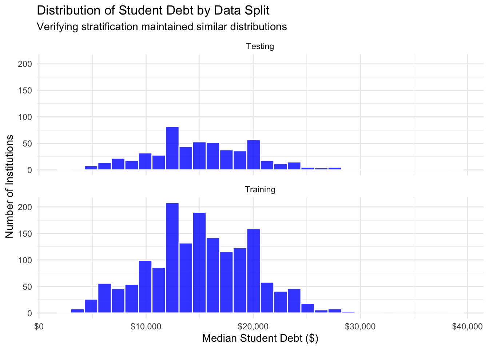
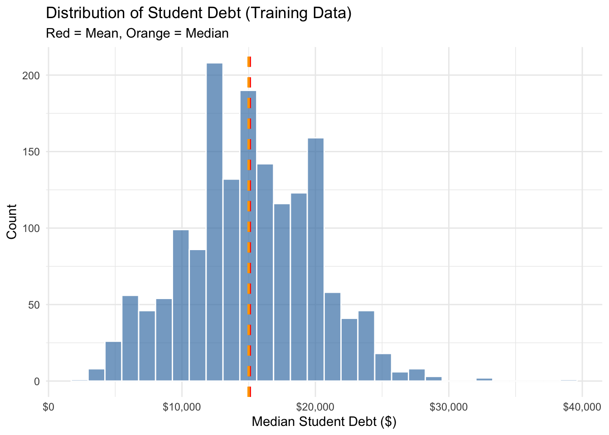
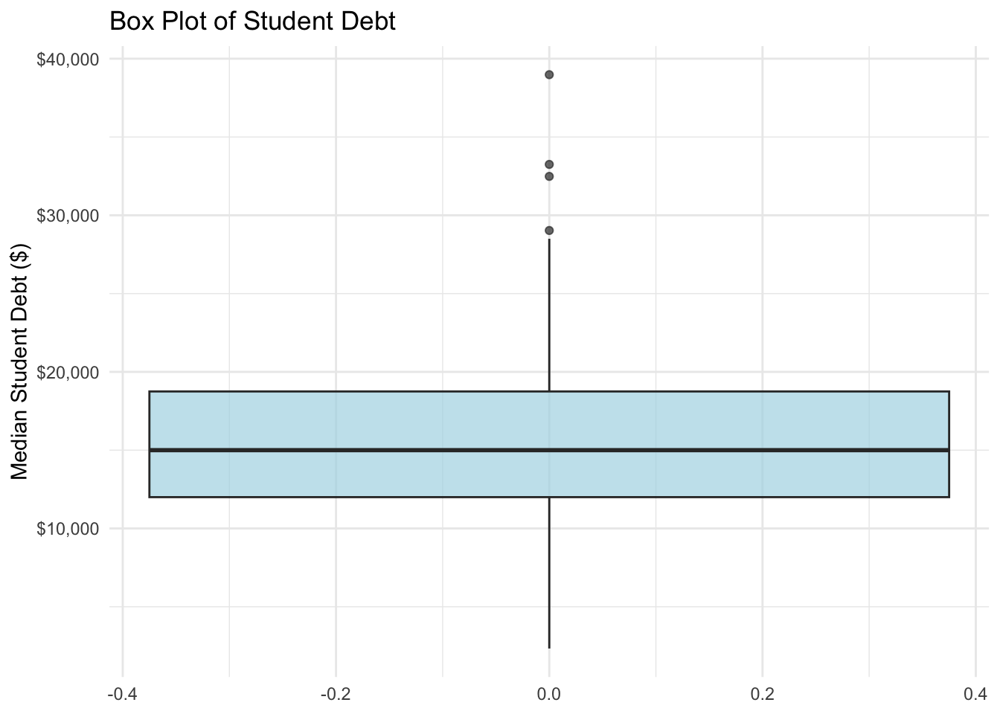
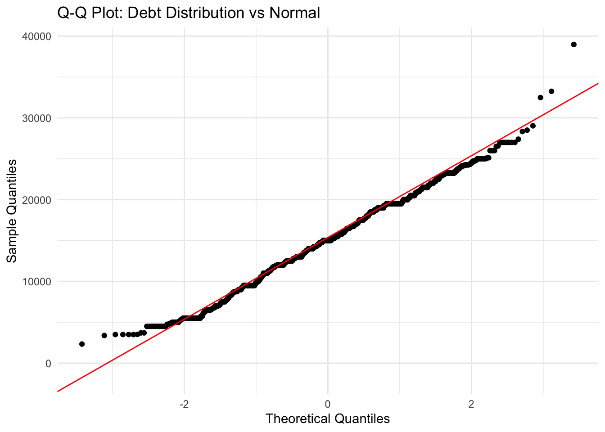

# HW-02: Build Better Data — College Scorecard

**Course:** INFO 4940/5940 — Applied Machine Learning, Fall 2025
[View PDF](hw-02-build-better-data.pdf) | [View HTML](hw-02-build-better-data.html)

---

## The Question

Can we predict the median student debt load at U.S. colleges and universities? Using the College Scorecard dataset, I built a regression pipeline — from data splitting through feature engineering to a tuned random forest — to find out how well institutional characteristics predict what students end up borrowing.

---

## Setting Up the Data

I dropped rows with missing debt values before splitting (not after) to avoid any chance of leakage, then used a 75/25 stratified split. The verification plot confirmed stratification worked — training and testing distributions are visually identical:

---

## Exploring the Outcome

Before touching any models, I dug into the debt distribution itself using training data only.

The histogram shows a roughly normal distribution with a slight right skew — mean and median differ by just $77. That's encouraging for linear regression since the normality assumption is mostly met. The extended right tail (some institutions over $30k) is something to watch.

The boxplot made those high-debt outliers much more visible. A handful of institutions are clearly pulling the right tail — these are the cases that will be hardest to predict accurately.

The Q-Q plot showed excellent normality in the middle quartiles — standard OLS inference can be trusted for most institutions. The upper tail deviates, which means residual plots for high-debt schools will need monitoring.

---

## Feature Engineering

I tested five candidate features one at a time — not all at once — to actually understand what was helping and to avoid overfitting:

| Feature | Idea | Result |
|---|---|---|
| `cost_earnings_ratio` | Net cost / median earnings | Hurt performance, dropped |
| `affordability_ratio` | Household income / net cost | Strongly degraded — unstable from division by small values |
| `academic_success` | Completion rate × retention rate | Tiny, negligible positive effect |
| `economic_need` | Pell % + first-gen rate | No measurable effect |
| `cost_net_sq` | Quadratic net cost term | **Only winner — consistent gain** |

The quadratic cost term captures mild nonlinearity in how very high costs drive debt. Only that feature and the academic success interaction made it into the final recipe — and even then, the improvement over basic linear regression was only ~1%.

---

## Model Comparison

All models evaluated through 10-fold stratified cross-validation:

| Model | RMSE | MAE |
|---|---|---|
| Null (predict mean) | $4,873 | $3,884 |
| Basic Linear Model | $3,652 | $2,733 |
| Enhanced LM (+ `cost_net_sq`) | $3,631 | $2,706 |
| **Tuned Random Forest** | **$3,218** | **$2,303** |

Feature engineering barely moved the needle on the linear model — it was already near its ceiling. The random forest captured the nonlinear relationships and feature interactions that linear models simply can't reach, hitting a **34% RMSE reduction over the null baseline**, well past the 25% target.

---

## Takeaway

The tuned random forest is the right final model here — not because linear models are bad, but because the data has structure that rewards flexibility. The dataset contains real nonlinear relationships between institutional costs, student demographics, and debt outcomes. The average prediction error of ~$2,300 per institution (vs. $3,884 for the null) is a meaningful improvement for any downstream use.
