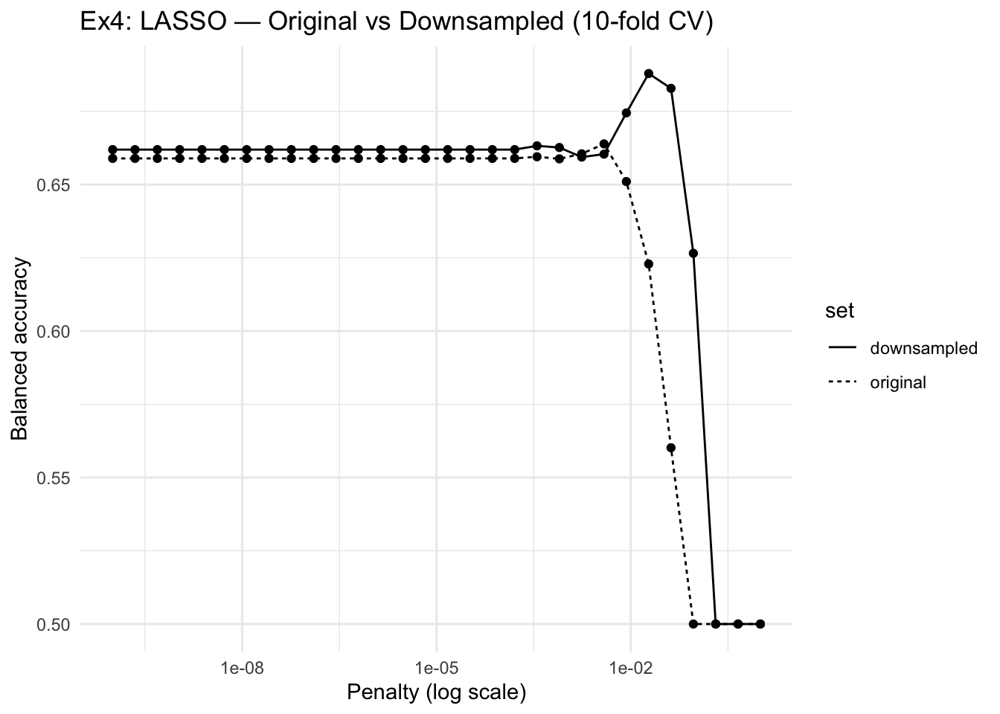
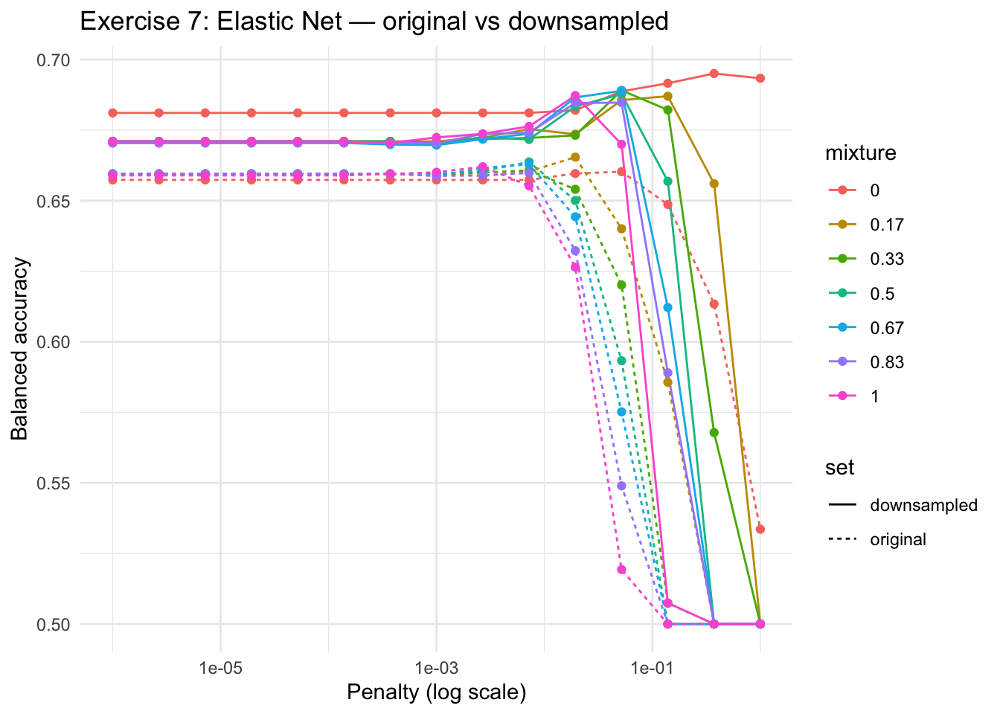

# HW-03: Tune and Evaluate Models — GSS Marijuana Legalization

**Course:** INFO 4940/5940 — Applied Machine Learning, Fall 2025
[View PDF](hw-03-tune-eval-models.pdf)

---

## The Question

Can we predict whether a survey respondent thinks marijuana should be legal, based on demographic and attitudinal data from the General Social Survey (GSS)? This is a classification problem — but one with a meaningful twist: the classes aren't balanced.

---

## Choosing the Right Metrics First

Before touching the data, I had to think about what "good" means here. With ~70% of respondents favoring legalization and ~30% opposing, plain accuracy is misleading — a model that just predicts "should be legal" for everyone gets 69.5% accuracy while learning nothing useful.

So I prioritized:
- **Balanced Accuracy** — equal weight to both classes, the primary metric throughout
- **Sensitivity & Specificity** — how well the model finds each class separately
- **ROC AUC** — overall discriminative ability across all thresholds
- **Brier Score** — how well-calibrated the predicted probabilities are
- **J-Index** — directly tied to balanced accuracy, good for threshold decisions

---

## Exploring the Data

The class imbalance showed up immediately: 69.5% favor, 30.5% oppose — a 2.3:1 ratio. That framed every decision downstream.

Then came the feature exploration. A few things stood out:

**Party ID was a strong predictor.** There's a clear 32-point ideological spread from Strong Democrat (78% favor) to Strong Republican (46%). One of the strongest signals in the dataset.

**Age was the biggest surprise.** A 48-percentage-point spread from under-30 (high support) to 75+ (low support). That's huge. Generational replacement is probably driving it — younger cohorts grew up with a completely different cultural relationship to cannabis than older cohorts did during the war on drugs era.

**Gun attitudes (gunlaw)? Surprisingly weak.** I expected more alignment between policy domains, but government attitudes don't seem to transfer uniformly across issues.

---

## The Downsampling Question

With a 2.3:1 class imbalance, I tested each model in two versions — one trained on original data, one with `step_downsample()` applied inside cross-validation (to prevent leakage).

For the LASSO, downsampling made a real difference:

| | Original LASSO | Downsampled LASSO |
|---|---|---|
| Balanced Accuracy | 0.664 | 0.692 |
| Sensitivity | 0.867 | 0.700 |
| Specificity | 0.461 | 0.683 |

Specificity jumped from 0.461 to 0.683 — the downsampled model stopped defaulting to the majority class. The trade-off was a drop in sensitivity (expected), and a small calibration cost in the Brier Score. Worth it.

---

## Comparing All Models

I ran four model families through 10-fold stratified CV: LASSO, elastic net, random forest, and kNN. The elastic net (downsampled) came out on top:

| Model | Balanced Accuracy | Specificity | ROC AUC |
|---|---|---|---|
| Null | 0.50 | 0.00 | 0.50 |
| LASSO (downsampled) | 0.692 | 0.683 | 0.754 |
| **Elastic Net (downsampled)** | **0.695** | ~0.68 | **0.754** |
| Random Forest | 0.611 | 0.327 | 0.692 |
| kNN | 0.540 | 0.153 | 0.673 |

The random forest had high sensitivity but terrible specificity — it just predicted "should be legal" for almost everyone. kNN was the weakest overall. The downsampled elastic net (a ridge-style logistic regression at λ ≈ 0.37) won on balanced accuracy while keeping both classes reasonably identified.

---

## Final Evaluation

Fitting the chosen model to the full training set and evaluating on the held-out 20% test:

| Metric | Value |
|---|---|
| Balanced Accuracy | 0.644 |
| Sensitivity | 0.665 |
| Specificity | 0.622 |
| ROC AUC | 0.683 |
| Brier Score | 0.219 |

The slight drop from CV (~0.695) to test (0.644) is expected — CV estimates tend to be slightly optimistic. The model generalizes well and remains clearly superior to the null. Sensitivity and specificity are balanced close to each other, which is exactly what a balanced accuracy framework is designed to produce.

---

## Takeaway

When classes are imbalanced, the choice of metric isn't just technical — it shapes every model selection decision downstream. Downsampling inside CV (to prevent leakage) was the single most impactful choice in this assignment. The elastic net's regularization also helped by shrinking irrelevant predictors rather than keeping noise in the model. In the end, political affiliation and age were doing most of the work — which makes intuitive sense.
