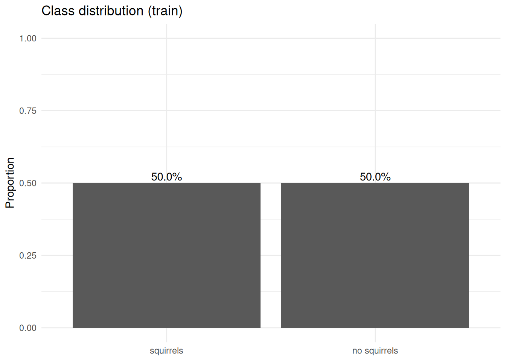
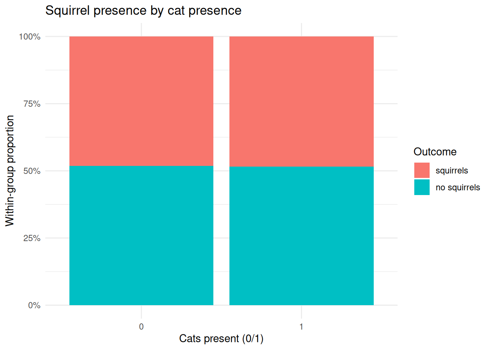
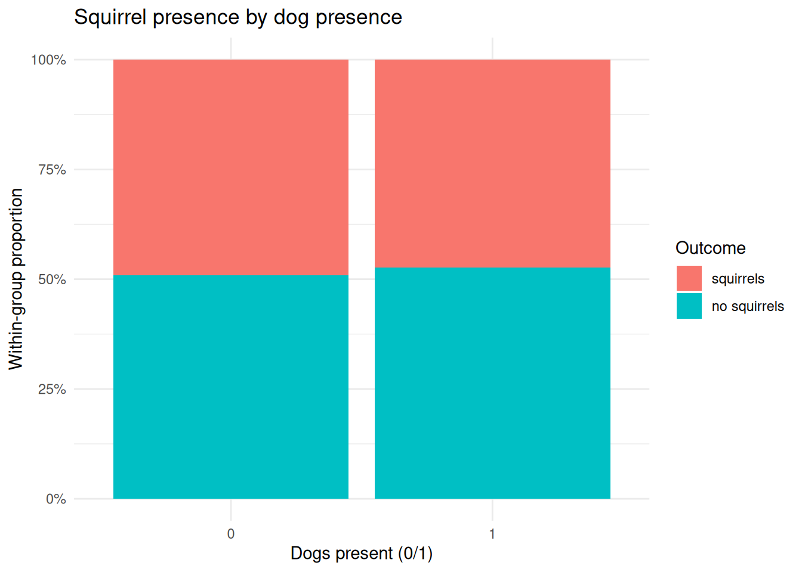
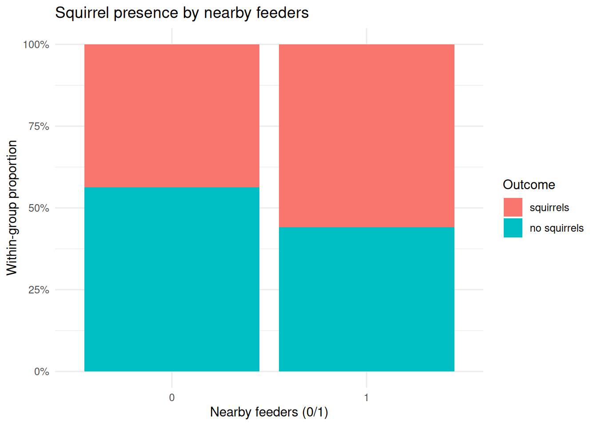
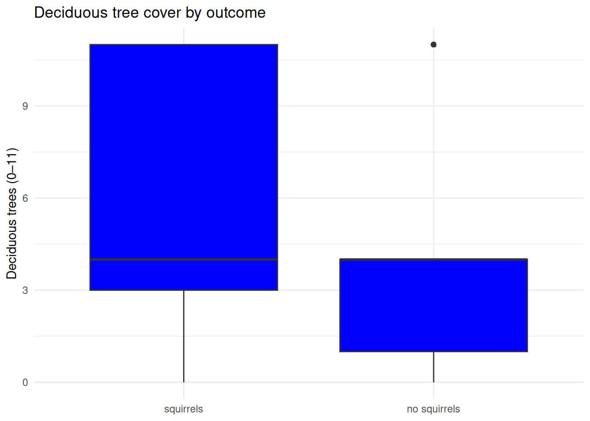
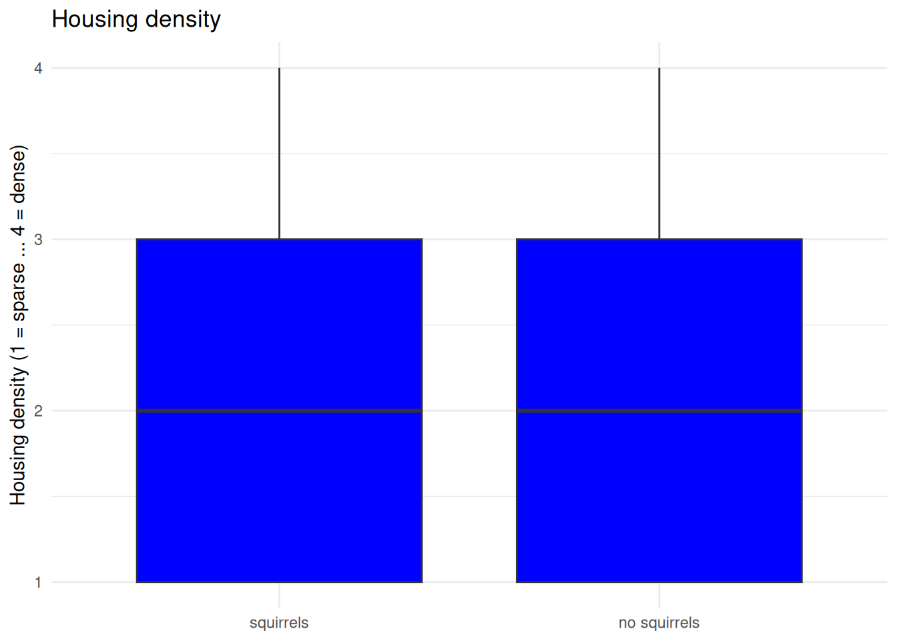

# Applied Machine Learning — INFO 4940/5940 (Fall 2025)

Course work from Cornell's Applied Machine Learning course. Projects use R (tidymodels) and Python (scikit-learn) across supervised learning, model evaluation, and feature engineering.

---

## Homework

### HW-00: R & Python Prefresher
**Folder:** `Homework/Prefresher R/`

Warm-up exercises in both R and Python covering data wrangling, visualization, and basic statistical operations. Used datasets on commissary prices and eating habits.

[View PDF (R)](Homework/Prefresher%20R/hw-00-prefresher-r.pdf) | [View PDF (Python)](Homework/Prefresher%20R/hw-00-prefresher-py.pdf)

---

### HW-01: Make a Model
**Folder:** `Homework/Prefresher/`

Built a classification model on NYC squirrel census data. Explored logistic regression with tidymodels, handled class imbalance using SMOTE (themis), and evaluated model performance.

[View PDF](Homework/Prefresher/hw-01-make-a-model.pdf)

**Key Outputs:**

---

### HW-02: Build Better Data
**Folder:** `Homework/Build Better Data/`

Feature engineering and data preprocessing on college scorecard data. Explored transformations, encoding strategies, and preprocessing pipelines in tidymodels to prepare data for downstream modeling.

[View HTML](Homework/Build%20Better%20Data/hw-02-build-better-data.html) | [View PDF](Homework/Build%20Better%20Data/hw-02-build-better-data.pdf)

**Key Outputs:**

---

### HW-03: Tune and Evaluate Models
**Folder:** `Homework/Tune and Evaluate Models/`

Hyperparameter tuning and model evaluation using cross-validation on GSS survey data. Compared multiple model families, tuned via grid search, and evaluated with ROC-AUC and other metrics.

[View PDF](Homework/Tune%20and%20Evaluate%20Models/hw-03-tune-eval-models.pdf)

**Key Outputs:**

---

### HW-04: Predict Coffee Preferences
**Folder:** `Homework/Predict Coffee Trends/`

End-to-end classification pipeline predicting coffee preference outcomes from survey data. Applied ensemble methods and tuned hyperparameters, with emphasis on model interpretability and performance reporting.

[View HTML](Homework/Predict%20Coffee%20Trends/hw-04-predict-coffee.html) | [View PDF](Homework/Predict%20Coffee%20Trends/hw-04-predict-coffee.pdf)

---

## Application Exercises

### AE-09: Feature Engineering — Coffee EDA
**Folder:** `Application Exercises/Feature Engineering/`

Exploratory data analysis on the Great American Coffee Taste Test dataset. Investigated missingness patterns and outliers in both R and Python.

**Python (missingno + seaborn):**

**R (naniar + ggplot2):**

---

## Stack

- **R:** tidymodels, tidyverse, themis, naniar, ggplot2
- **Python:** scikit-learn, pandas, missingno, seaborn, matplotlib
- **Tooling:** Quarto, R Markdown, VS Code
