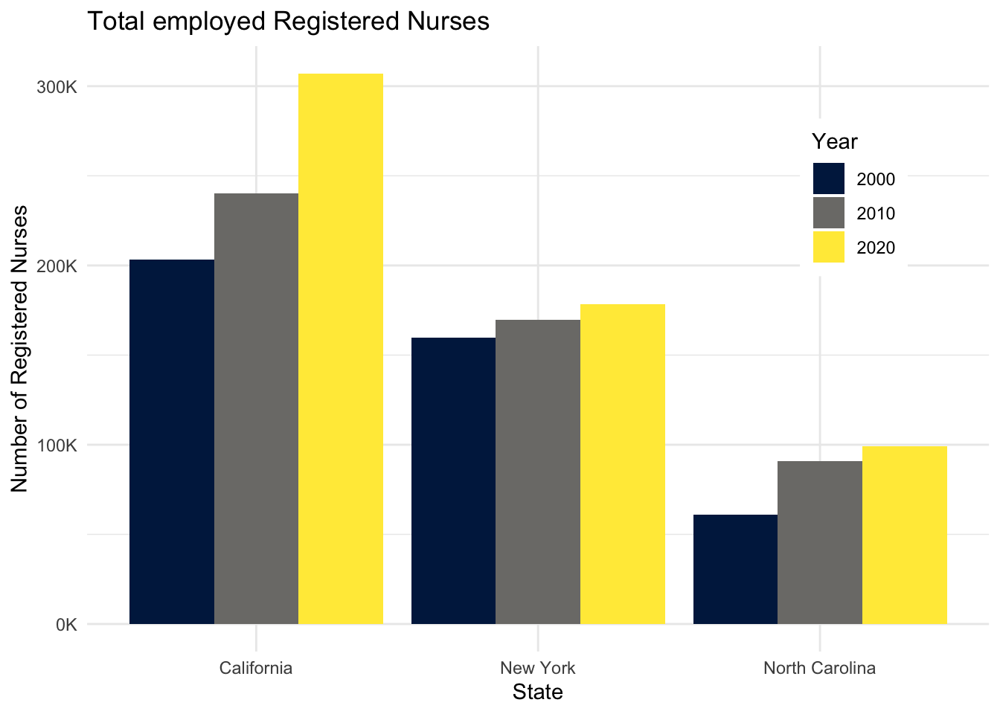
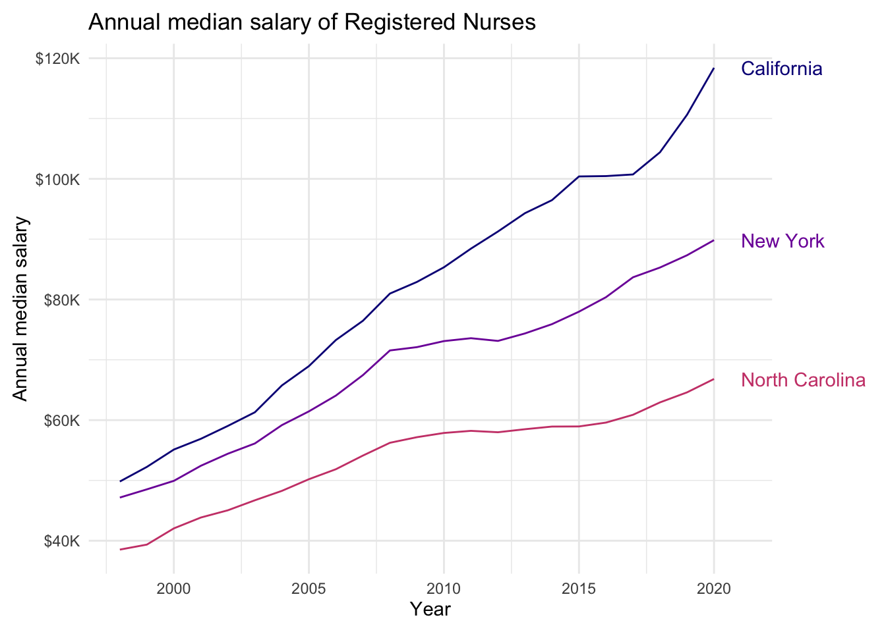
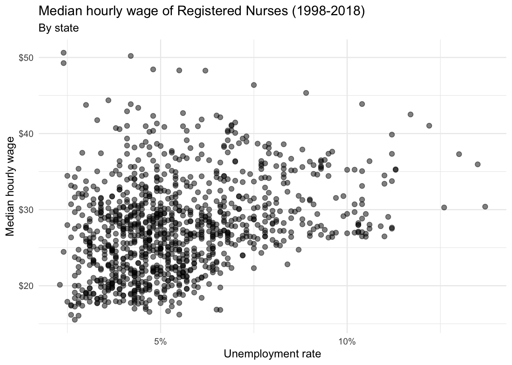

# AE-11: Accessible Data Visualizations — Nursing Employment

**Course:** INFO 3312/5312 — Data Communication, Spring 2025
[View HTML](ae-11-accessible-viz.html)

---

## The Focus

Accessibility isn't just about color choices — it's about writing alt text that actually describes what a visualization shows. This exercise used nursing employment data across U.S. states to practice writing descriptive alt text for three chart types.

---

## Bar Chart: Total Employed RNs

California, New York, and North Carolina at three snapshots in time (2000, 2010, 2020). All three states grew their RN workforce — California stays roughly 3× North Carolina's total:

---

## Line Chart: Median Salary Trends

California's median RN salary pulled ahead to ~$120K by 2020. North Carolina reached ~$70K. The gap widened over time — that detail only becomes visible in the line chart, not in a bar chart snapshot:

---

## Scatterplot: Unemployment vs. Median Wage

State unemployment rates plotted against median hourly RN wages. No strong correlation — nursing wages appear to be driven by healthcare-specific supply and demand, not general labor market conditions:

---

## The Accessibility Principle

Good alt text describes: the chart type and what it measures, the key trend or pattern, and any specific notable values. It's not a caption ("Bar chart of nursing data") — it's a full verbal equivalent of what a sighted reader would take away from the chart.
