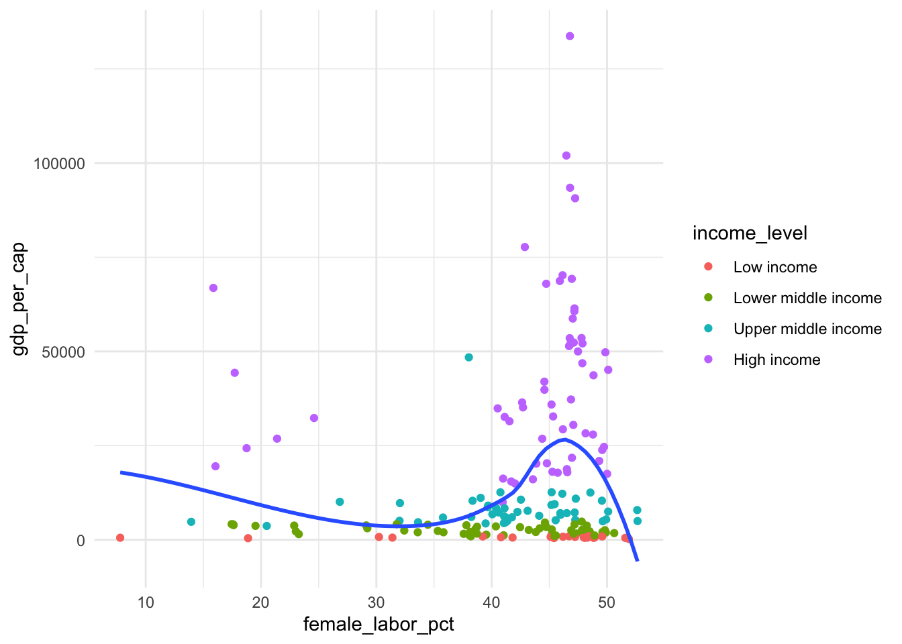
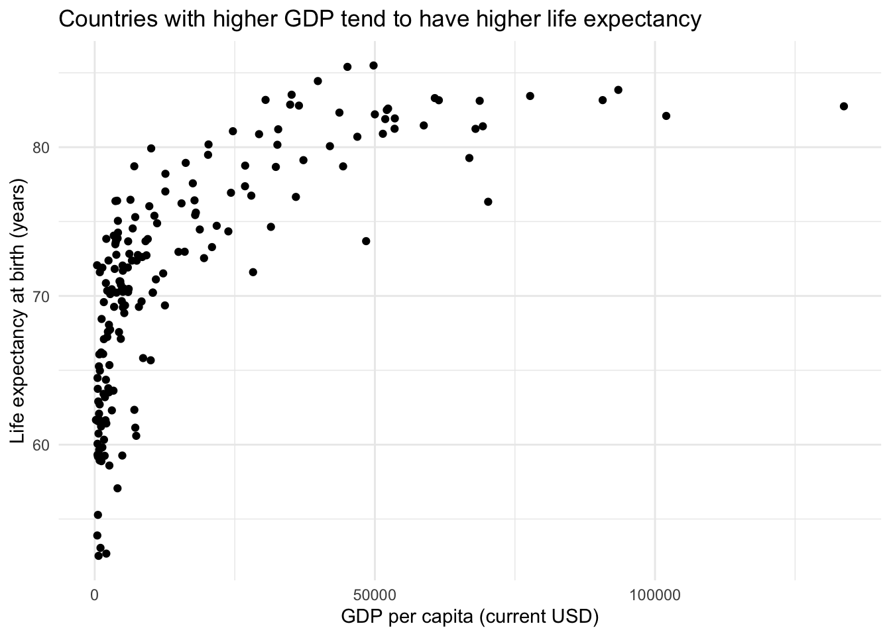

# AE-04: Adjusting Scales — World Bank Indicators

**Course:** INFO 3312/5312 — Data Communication, Spring 2025
[View HTML](ae-04-scales-guides.html)

---

## The Question

How does log-transforming the x-axis change what we see in the relationship between GDP per capita and life expectancy?

Data: World Bank development indicators, 2021. Countries colored and shaped by income level classification.

---

## Before the Transformation

On a linear scale, most countries cluster in the lower-left corner — the distribution of GDP is so skewed by high-income outliers that the differences between low- and middle-income countries get compressed and hard to read:

## After Log Transformation

`scale_x_log10()` spreads countries out across the full x-axis, revealing a clear positive relationship across all income levels. The pattern becomes nearly linear in log space:

Income level is encoded with both color (viridis, reversed so higher income = lighter/yellow) and shape — two redundant channels that make the groupings readable even in greyscale or for colorblind readers.

---

## Implementation Notes

- `scale_x_log10(labels = label_dollar())` — log scale with dollar formatting
- `scale_color_viridis_d(direction = -1)` — reversed so "high income" = yellow
- `guides(color = guide_legend(reverse = TRUE))` — legend order matches visual order on chart

---

## What It Shows

The wealthier a country, the longer its citizens tend to live — but the relationship is logarithmic, not linear. Going from $1,000 to $10,000 in GDP per capita buys far more life expectancy than going from $50,000 to $100,000. The log scale makes that structure visible instead of hiding it in the corner.
