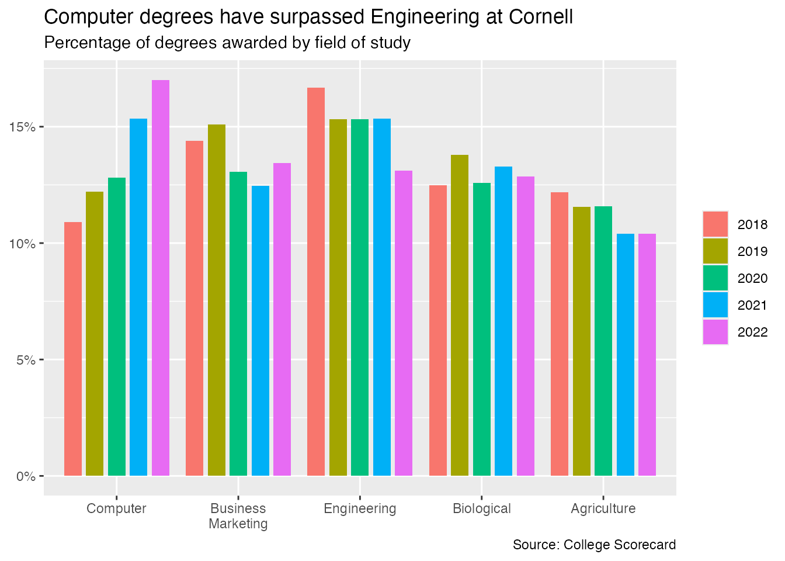

# AE-08: Custom ggplot2 Theme for Cornell

**Course:** INFO 3312/5312 — Data Communication, Spring 2025
[View HTML](ae-08-cornell-theme.html)

---

## The Goal

Build a reusable `theme_cornell()` function that brings Cornell's visual identity into ggplot2 — consistent typography, brand colors, and layout decisions that can be applied to any chart in the project.

Data: Cornell University degrees awarded by field of study, 1996–2022.

---

## The Theme in Action

---

## Building `theme_cornell()`

Key design decisions:

- **Font**: Spectral — a free Google Font with serif character close to Palatino (Cornell's traditional typeface)
- **Color palette**: Cornell brand colors — `#B31B1B` (Carnelian), `#006699`, `#6EB43F`, `#F8981D`, `#EF4035`, `#073949`
- **Background**: White with y-axis gridlines only — horizontal gridlines removed to reduce noise
- **Title/subtitle**: Centered over the full plot, not just the panel
- **Legend**: Bottom-positioned, horizontal layout

---

## What the Data Shows

Computer Science degrees have surpassed Engineering degrees at Cornell — a shift visible from the late 2000s onward, and a pattern common across many research universities as CS enrollment outpaced traditional engineering programs.

---

## Why Custom Themes Matter

Applying `theme_cornell()` once at the top of a project enforces visual consistency across every chart without repeating styling code. Same font, same colors, same layout decisions — automatically.
