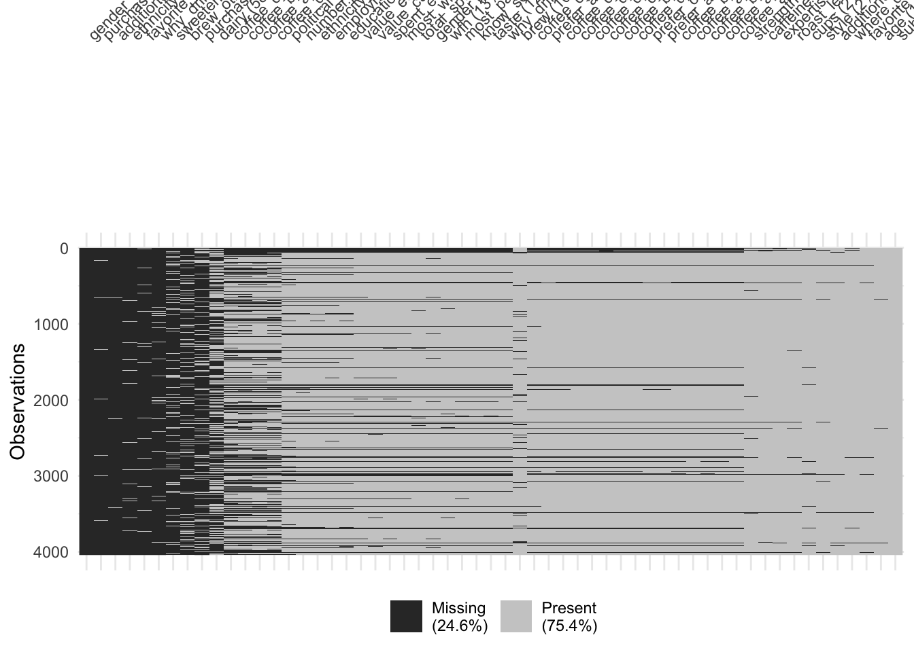
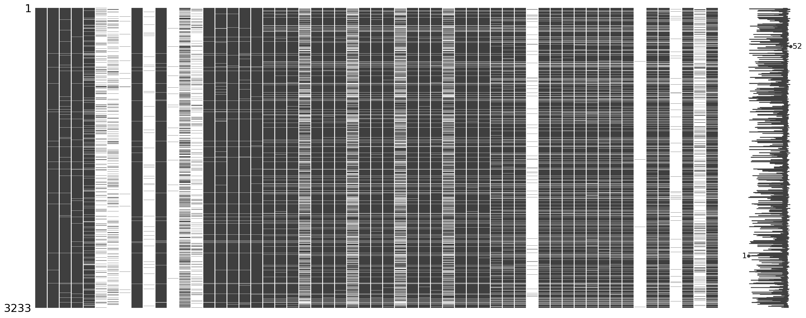
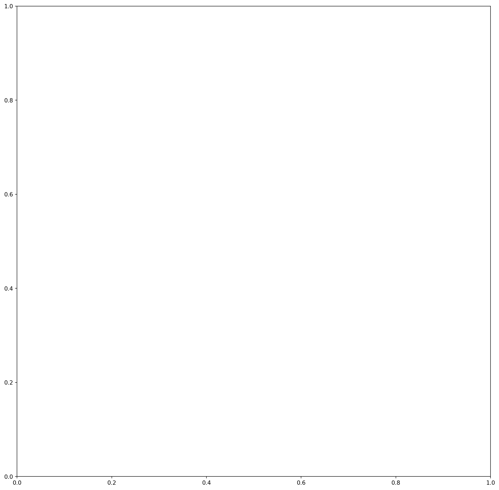
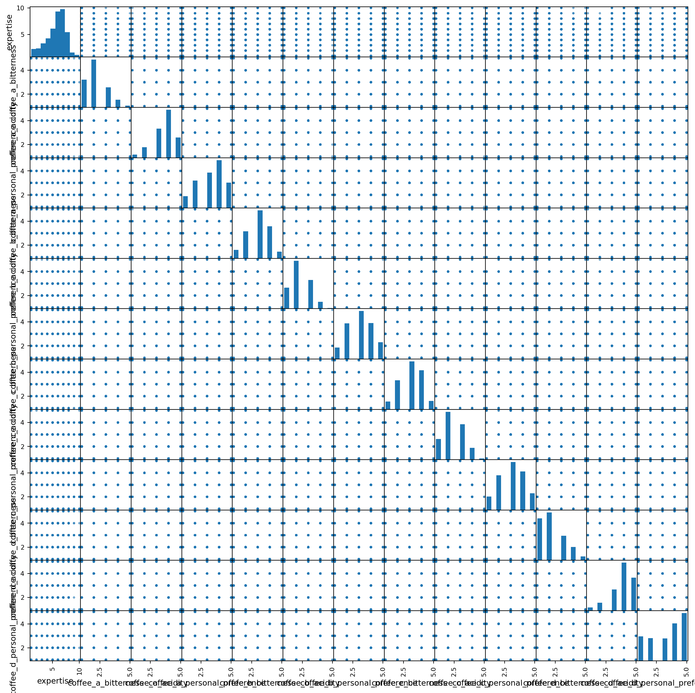
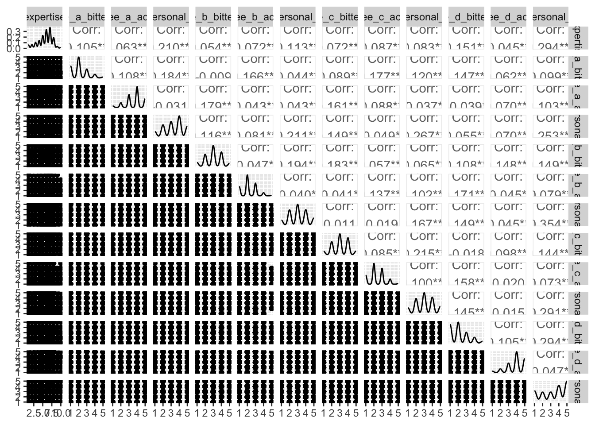

# AE-09: Exploring Coffee Taste Tests

**Course:** INFO 3312/5312 — Data Communication, Spring 2025
[View HTML (R)](ae-09-eda-coffee-r.html) | [View HTML (Python)](ae-09-eda-coffee-py.html)

---

## The Goal

Exploratory data analysis on the Great American Coffee Taste Test — a 2023 YouTube event where James Hoffmann and Cometeer sent four coffees to viewers who rated them live. The goal here was to understand the structure and data quality before any modeling.

Done in parallel in R and Python.

---

## Missingness Analysis

A significant chunk of the survey is missing — mostly optional follow-up questions (brew_other, purchase_other, "specify" fields) that most respondents skipped.

**R (visdat) — column order, sorted by % missing, clustered by pattern:**

**Python (missingno) — same three views:**

---

## Outlier Detection

Scatterplot matrices across all numeric variables — bitterness, acidity, and personal preference ratings for each of four coffees, plus self-reported expertise. The variables are all rating scales, so extreme outliers aren't present. The more interesting finding is the correlation structure between bitterness and personal preference within coffees.

---

## Connection to Modeling

The missingness patterns here directly shaped the preprocessing recipe in HW-04: `step_unknown()` for categoricals with missing values, `step_impute_median()` for numerics, and `step_other(threshold = 0.005)` to collapse the many sparse "other" category levels.
