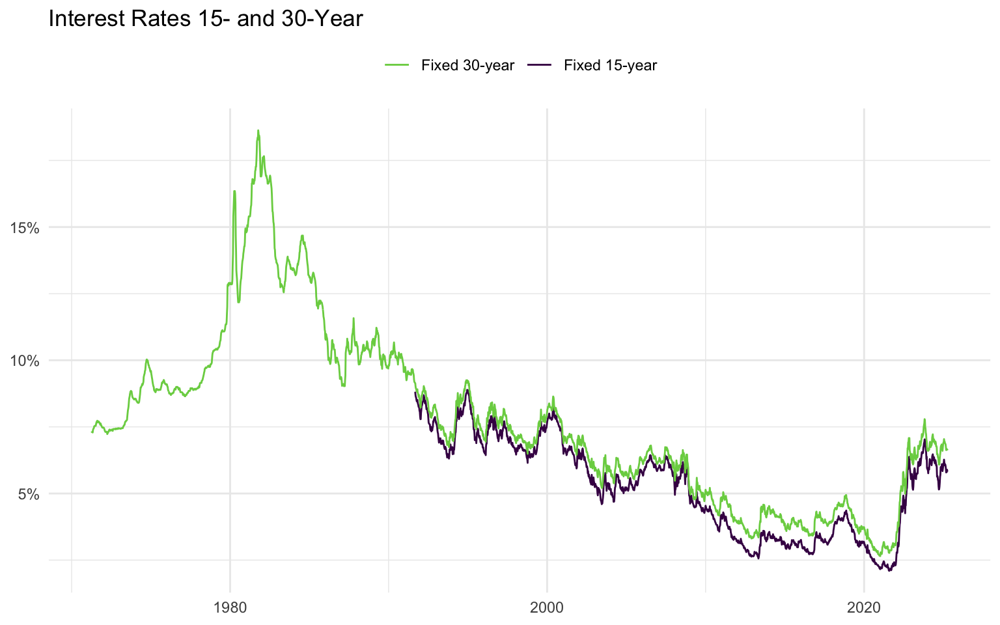
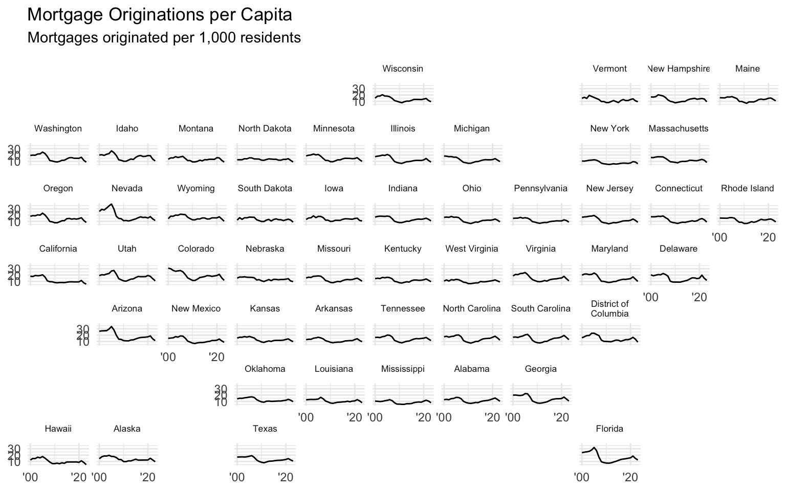
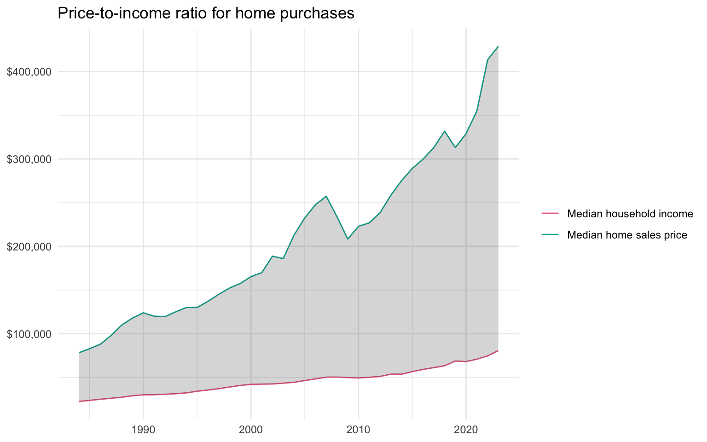

# AE-21: Housing Market at a Glance

**Course:** INFO 3312/5312 — Data Communication, Spring 2025

---

A Quarto dashboard that puts the U.S. housing affordability crisis in context — mortgage rates, price-to-income ratios, and origination patterns by state, woven into a single interactive view.

## The Story

Three datasets, three layers of the same crisis.

**Mortgage rates** from the NAHB document the dramatic rate environment since 2022. After a decade hovering near historic lows (2–3%), 30-year fixed rates climbed above 7% by late 2023 — the fastest sustained rise since the early 1980s. Both the 15- and 30-year rates are encoded in the same line chart using `scale_color_viridis_d()`, reversed so the higher-rate 30-year maps to the darker line.

**The price-to-income gap** from FRED is the centerpiece of the affordability story. Median home sale price and median household income are plotted as two lines, but the real signal is the `geom_ribbon()` shading the gap between them. Through the 1980s and 1990s the gap was manageable. By the 2020s it has stretched to the widest spread in the dataset's history — median homes now cost roughly 6× the median annual household income.

**Mortgage originations per capita** (mortgages originated per 1,000 residents) tell the geographic story. The `geofacet` small-multiple layout — one panel per state, all sharing the same axes — reveals that the 2005–2008 housing bubble and subsequent crash were not uniformly distributed. Nevada, Florida, and Arizona show dramatic boom-bust cycles. Midwest states show relative stability. This design choice was deliberate: a single national aggregate would have hidden exactly the geographic variation that mattered most.

## Dashboard Design

Built with Quarto's `format: dashboard` using the `litera` Bootswatch theme. Three columns:

- **Stats (20% width):** Three value boxes — current 30-year rate, current 15-year rate, national median home price — all computed dynamically with `slice_tail()` so they update with the data rather than hardcoding the values
- **Center:** The `geofacet` origination chart stacked above an interactive `gt` table of weekly mortgage rates (`opt_interactive(use_search = TRUE, pagination_type = "jump")`) so users can look up any week's rate directly
- **Right:** The interest rate line chart and price-to-income ribbon chart stacked vertically

The key design decision was `geom_ribbon()` over two separate lines for the affordability gap. Two lines require the viewer to mentally compute the distance. The ribbon encodes that distance as area — the visual system processes it immediately, without arithmetic.

---

[View the full dashboard →](docs/index.html)
