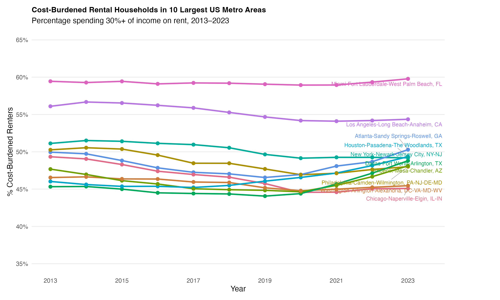

# AE-19: Cost-Burdened Rental Households

**Course:** INFO 3312/5312 — Data Communication, Spring 2025
[View HTML](ae-19-rental-burden.html)

---

## The Dataset

Rental housing cost burden in the 10 largest US metro areas, 2013–2023. A household is "cost-burdened" when it spends 30% or more of its income on rent. Data from HUD/Census.

---

## Two Versions of the Same Chart

**Static** (ggplot2 + ggrepel): A line chart with one line per metro area, y-axis limited to 35–65%, and direct text labels at the 2023 endpoint using `geom_text_repel()`. Qualitative Dark 3 palette for distinguishing 10 lines. The static version is clean and publication-ready.

**Interactive** (plotly): The same chart converted to plotly with custom hover text showing metro area name, year, and exact percentage. `highlight()` enables hover-to-emphasize behavior, and double-click resets the view. The interactive version is better for exploration — readers can isolate individual metros without the chart becoming cluttered.

---

## What the Data Shows

Cost burden trends vary substantially by metro area. Some cities have seen steady increases; others plateaued or even declined slightly. The variation isn't random — it tracks closely with local housing supply constraints, population growth, and rent control policies.

The interesting comparison isn't just "which cities are most burdened" (Miami and LA consistently rank high) — it's which cities saw the sharpest acceleration post-2020 as pandemic-era rent increases hit renters hard.

---

## Static vs. Interactive

The right format depends on the audience. For a report or publication: static, with carefully chosen direct labels. For an exploratory tool or web dashboard: interactive, so readers can answer their own questions about specific metros. This exercise builds both from the same underlying data and ggplot specification.
