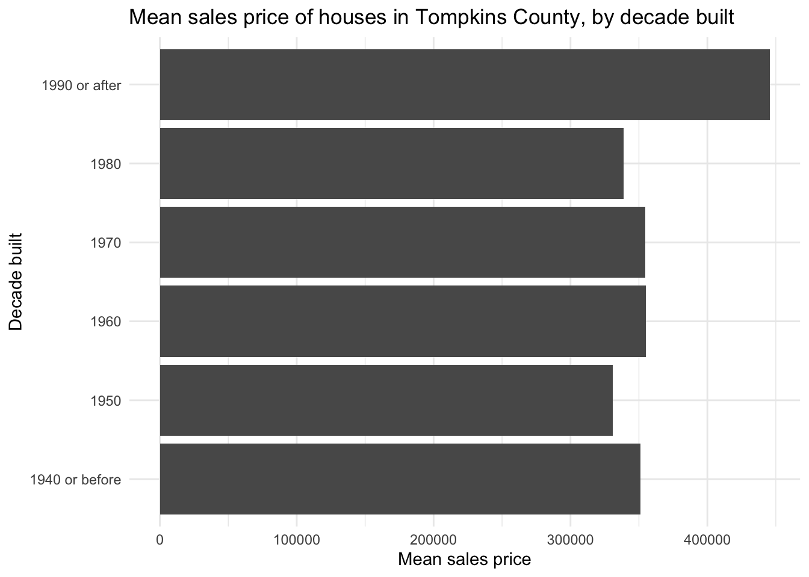
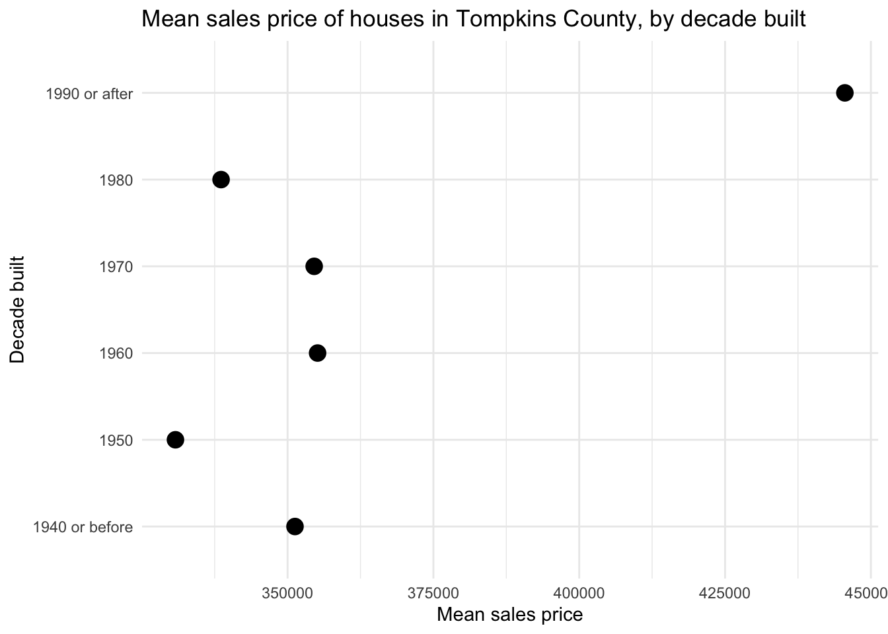

# AE-02: Lollipop Chart — Tompkins County Home Sales

**Course:** INFO 3312/5312 — Data Communication, Spring 2025
[View HTML](ae-02-lollipop.html)

---

## The Question

Which chart type communicates mean home sale prices by construction decade most effectively — a bar chart, a dot plot, or a lollipop chart?

Data: Tompkins County, NY home sales from 2022–2024.

---

## The Progression

Starting with a standard bar chart, then stripping it down step by step:

**Bar chart** — solid bars showing mean sale price by decade built. Works, but a lot of ink for a simple comparison:

**Lollipop chart** — a dot at the value connected by a thin line. Same information, much less visual weight. The reader's eye goes straight to the point rather than scanning across a filled bar:

Built with `geom_point()` + `geom_linerange()`. The lollipop is a useful middle ground — more precise than a bar (the exact position matters, not just the length), but less cluttered than a full scatter.

---

## What the Data Shows

Homes built more recently tend to sell for more — which makes sense given newer construction, updated features, and less depreciation. The oldest decade categories show the lowest average prices, with a general upward trend into the 2000s and 2010s.

---

## Key Concept

This exercise is about **data-ink ratio** — Edward Tufte's principle that every mark on a chart should carry information. The bar chart uses a lot of ink to encode a single number per category. The lollipop reduces that ink without losing anything meaningful.
