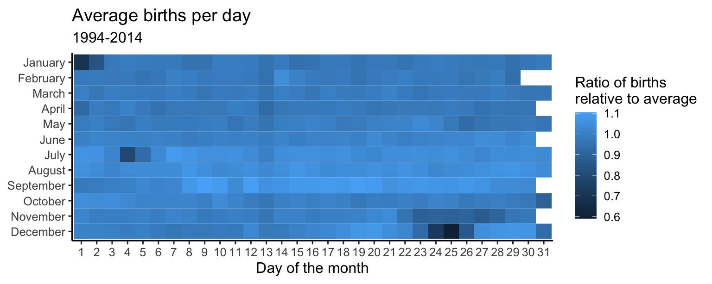

# AE-15: Optimizing Color Spaces — US Daily Births

**Course:** INFO 3312/5312 — Data Communication, Spring 2025
[View HTML](ae-15-colorspace.html)

---

## The Question

Are there systematic patterns in when Americans are born — and can color encode them effectively?

Data: US daily births, 1994–2014.

---

## The Heatmap

A calendar heatmap showing births by day, with a diverging color scale centered at 1.0 (the average). Values above average pull toward one end; below average toward the other:

---

## What Stands Out

**Holidays**: December 25th and January 1st are the darkest cells — fewest births of the year, consistently. Scheduled C-sections and inductions get moved away from major holidays, and that's visible across two decades of national data.

**Friday the 13th**: Births on Friday the 13th run ~12% below the average for other Fridays — a real, measurable effect of superstition on medical scheduling decisions.

**Weekends**: Births are systematically lower on Saturdays and Sundays throughout the dataset, reflecting the drop in elective procedures outside of weekday hospital hours.

---

## Color Design

`colorspace::scale_fill_continuous_diverging("Red-Green")` with midpoint at 1.0 is the right tool here — a sequential palette would show that a day is unusual, but not whether it's unusually high or low. The diverging scale makes that direction immediately visible.

Perceptually uniform interpolation from `colorspace` ensures the middle of the scale looks like the middle — unlike some built-in palettes where the transition isn't even.
