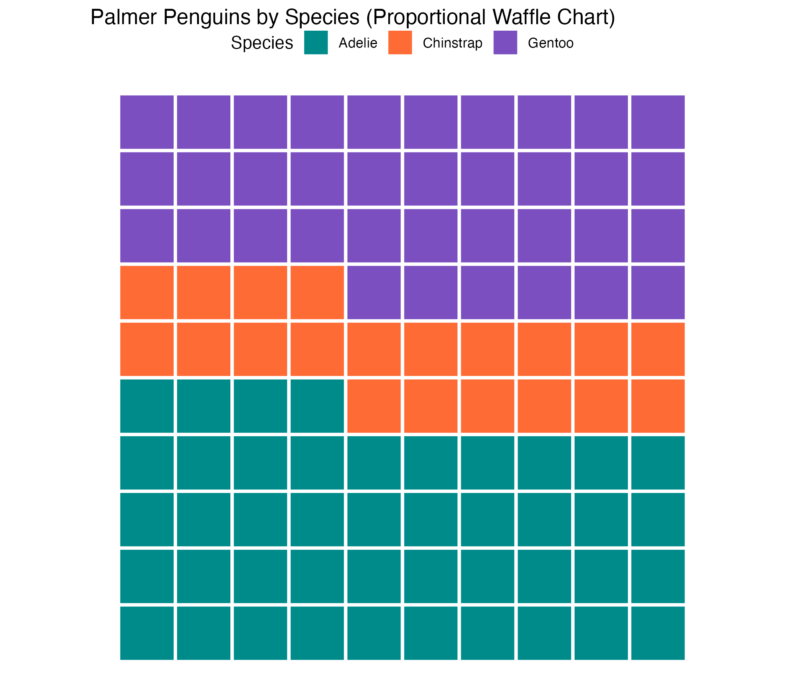

# AE-05: Waffle Charts — Palmer Penguins

**Course:** INFO 3312/5312 — Data Communication, Spring 2025
[View HTML](ae-05-waffle-chart.html)

---

## The Goal

Visualize the proportional breakdown of penguin species in the Palmer Penguins dataset using waffle charts — a grid-based alternative to pie charts that makes proportions easier to compare precisely.

---

## Why Waffle Charts

Pie charts require readers to judge angles, which humans are notoriously bad at. Waffle charts replace that with a grid of equal-sized squares — readers count or estimate by area, which is more accurate and more intuitive.

With `make_proportional = TRUE`, the chart shows percentages rather than raw counts, so three species of very different sizes can be compared on the same scale.

---

## Implementation

```r
geom_waffle(
  flip = TRUE,
  n_rows = 20,
  make_proportional = TRUE
) +
coord_fixed() +
theme_void()
```

- `flip = TRUE`: fills left-to-right instead of bottom-to-top
- `n_rows = 20`: 20 rows × 5 columns = 100 squares total, so each square = 1%
- `coord_fixed()`: ensures squares stay square regardless of plot dimensions
- `theme_void()`: removes all non-data elements for a clean look

---

## The Data

Three penguin species from the Palmer Archipelago (Antarctica): Adelie, Chinstrap, and Gentoo. Adelie makes up the plurality, with Chinstrap the smallest group. The waffle chart makes these proportions immediately readable without needing to decode angles or arc lengths.

[](figures/waffle-penguins.png)
