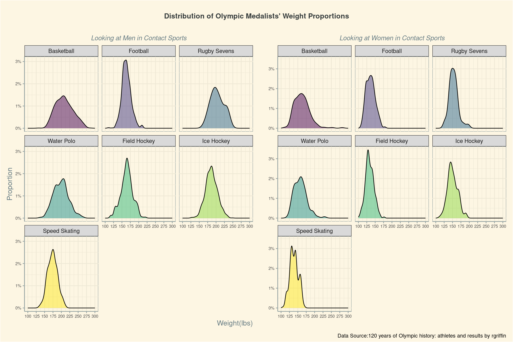
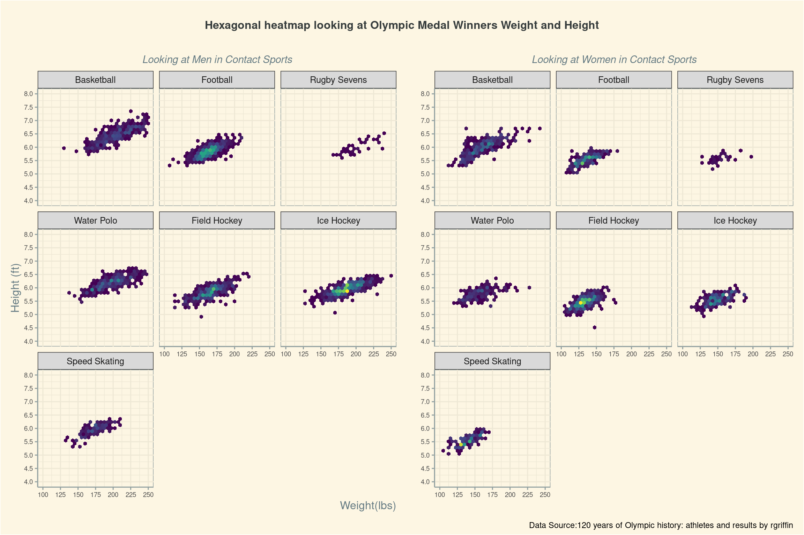
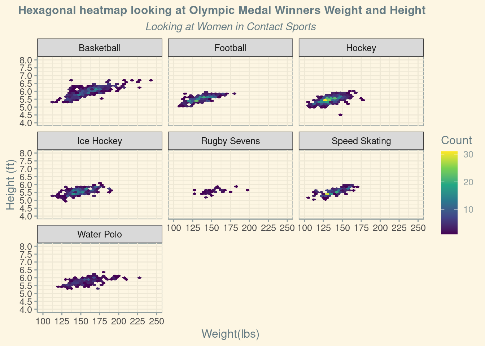

# Project 1 — Olympic Participation: Global North vs. South

**Course:** INFO 3312/5312 — Data Communication, Spring 2025
**Team:** Giving-Clapback — Israel Davidson, Emma Chase, Paul Vermette, Catherine Liu

---

The Olympics is the world's largest athletic stage — but who actually gets to be on it? This project uses 120 years of Olympic history (Athens 1896 through Rio 2016) to examine whether the Games have ever truly been global, and whether physical attributes predict a medal in contact sports.

## Question 1: Has Global South Participation Grown Over Time?

Country classification drew on the Worldwide Bureaucracy Indicator (WWBI) region column. Countries no longer in existence required manual remapping: the Soviet Union → Russia, Czechoslovakia → Czech Republic, Yugoslavia → Serbia, West Germany → Germany. East Germany was mapped to Russia, reflecting its status as a Soviet satellite state. NORRAG's definition served as a second check for edge cases in "Europe and Central Asia."

The analysis needed to separate Summer and Winter games — the two seasons operate at completely different scales and tell different stories. An `interaction()` of season and Global South status drove the color mapping, with four distinct hues: green/yellow for Summer, two blues for Winter.

**Line chart — raw athlete counts over time:**

The raw scale reveals the overall growth story. Global South Summer participation has climbed substantially — but the Winter Games barely move. The 1980 Moscow boycott is visible as a sharp Global North dip paired with an unusual Global South increase. The dissolution of the Soviet Union in 1991 produces the opposite pattern: an immediate Global South drop as former Soviet republics recategorized into the Global North.

**Proportional bar chart — share of athletes per Games:**

Switching from raw counts to proportions makes the seasonal contrast sharper. The Summer Games have trended toward ~40% Global South share over the past four decades. The Winter Games are nearly flat — a pattern that makes geographic sense, since the Global South largely lacks the winter climate infrastructure that produces competitive alpine and Nordic athletes. A subtle question the data raises: the majority of Olympic events trace to European and American origins. If more sports from the Global South were added to the program, would the participation gap narrow?

---

## Question 2: Does Body Size Predict a Medal in Contact Sports?

The analysis filtered to seven contact sports without weight classes: Basketball, Water Polo, Field Hockey, Football, Rugby Sevens, Ice Hockey, and Speed Skating. These sports were chosen specifically because weight categories (as in wrestling or judo) would make size comparisons circular — you're literally sorted by weight before competing. Heights and weights were converted to imperial units to match an American audience's intuition.

**Density plots — weight distributions of medalists by sex:**

Faceted by sport and split by sex using `patchwork`, the density curves show where medalist weights concentrate. Men's Basketball and Football push the distribution notably higher (200+ lbs), while Speed Skating medalists cluster at a lower range. Women show a tighter distribution overall, with more overlap between sports. The `scale_fill_viridis_d()` palette keeps the facets visually distinct without over-saturating.

**Hex bin plots — height × weight joint distribution:**

Rather than scatterplots — which overplot badly with this many data points — hexagonal bins use color intensity to show density. Men's Basketball medalists cluster visibly at 6'4"–6'8" and 200–230 lbs. Speed Skating shows a notably different profile: shorter and lighter. For women, the sport-to-sport differences are less extreme, though Basketball still produces the tallest distribution. Both plots share fixed axis limits (`x: 100–250 lbs`, `y: 4–8 ft`) so the facets remain directly comparable across the patchwork panel.

The overall finding: size matters — but differently by sport. There's no universal "Olympic body." The more interesting result is how dramatically the distributions diverge by sport, suggesting that event selection, not raw athleticism, drives the physical profile of medalists.

---

[Read the full analysis →](docs/index.html)
