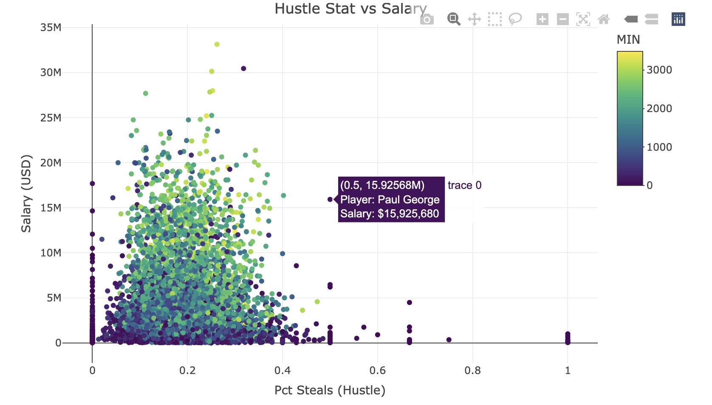
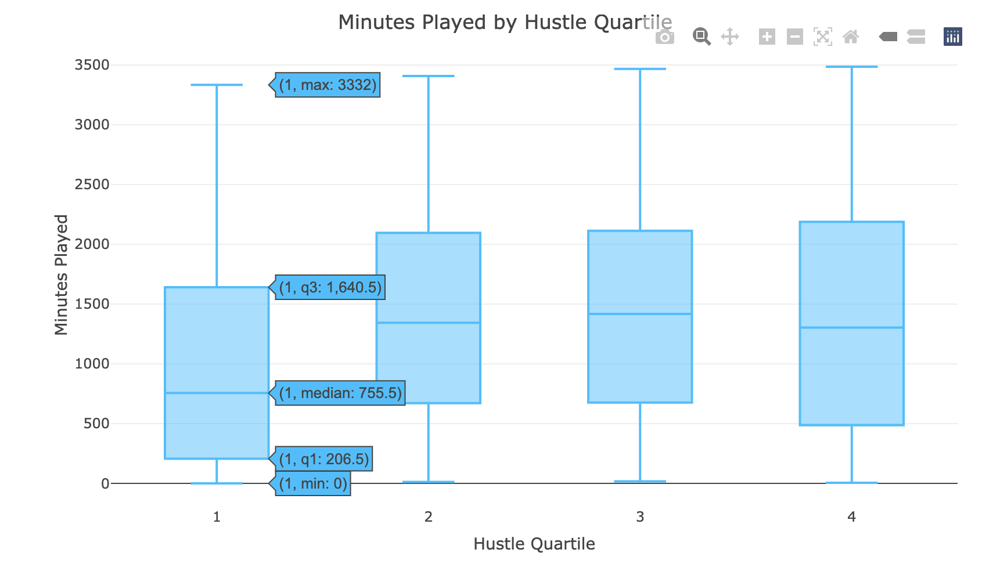
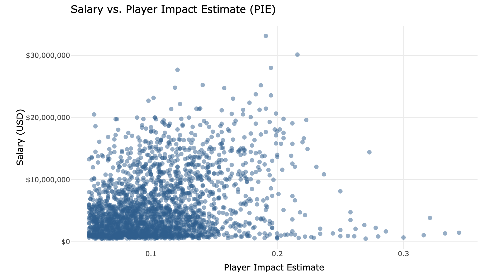
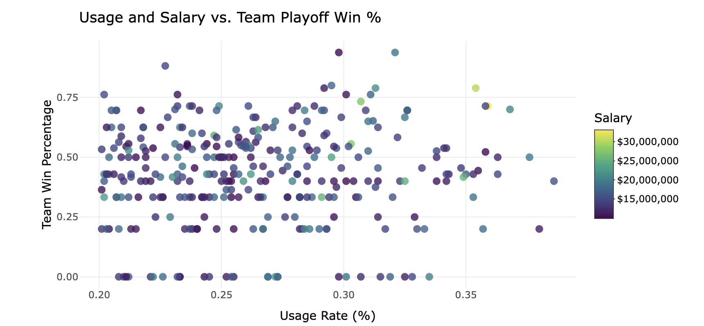

# Project 2 — NBA: Does the Data Match the Dollars?

**Course:** INFO 3312/5312 — Data Communication, Spring 2025
**Team:** Giving-Leopard

---

In modern basketball, data drives everything — roster construction, contract negotiations, broadcast coverage. But does the data actually align with how players are paid, how long they last, and how the game has evolved? This project builds an interactive website from 1996–2023 NBA statistics to answer four questions where the gap between numbers and salary might surprise you.

Dataset: [NBA player and team stats, 1996–2023](https://github.com/Brescou/NBA-dataset-stats-player-team/tree/main)

---

## Q1: Is Hustle Rewarded in the Paycheck?

Hustle — proxied by `Pct Steals` for its availability and interpretability — was compared against salary and minutes played to test whether effort translates to compensation.

**Hustle vs. Salary:**

The scatter tells a messy story: some of the highest-effort players earn mid-range salaries, while several highly-paid players sit at mediocre hustle levels. The distribution is wide — hustle alone doesn't move the needle on contracts.

**Hustle vs. Minutes Played:**

The relationship here is cleaner. Players with higher hustle metrics tend to earn more playing time — coaches reward effort on the floor even when front offices don't reward it in the contract. The salary color mapping makes the outliers pop: high-hustle, high-minutes players who are still underpaid.

**Minutes by Hustle Quartile:**

Splitting players into four hustle quartiles and boxing their playing time distributions confirms the trend systematically. The top hustle quartile has both a higher median and a longer upper tail — elite defenders and scrappy role players who earn their minutes. Using minutes rather than salary for the y-axis was a deliberate choice: salary distributions have extreme outliers that pull scales dramatically; minutes provide a more stable measure of a team's actual reliance on a player.

---

## Q2: Do Better Defenders Last Longer?

If defense wins championships, does it also extend careers?

**Defensive Rating vs. Career Length:**

The scatterplot of each player's best single-season defensive rating against total seasons played shows wide spread at short tenures — many short-career players had strong or weak defense, so defense alone doesn't guarantee longevity. But the players with the longest careers — 15+ seasons — tend to have achieved at least one elite defensive season at some point. Elite defense appears necessary but not sufficient for a long career.

**Career Length by Defensive Tier:**

Grouping players into the top 25% of defenders vs. the rest and comparing career length via boxplots makes the hypothesis clearer. The elite defensive tier has a higher median career length and a longer upper whisker — several players reaching 20+ seasons. Defensive value keeps you employed.

**Median Defensive Rating by Era:**

A critical control: defensive ratings have drifted upward over time as the pace and scoring of the modern game increased. Comparing a 1996 defender directly to a 2022 defender without era adjustment would be misleading. The era trend line shows the systematic shift and motivates keeping comparisons within-era or era-adjusted.

---

## Q3: How Have Big Men Transformed in the Three-Point Era?

The "small-ball era" forced traditional centers to develop perimeter skills or lose their roster spots. Did the data show it happening in real time?

**Evolution of 3-Point Attempts Among Big Men:**

A time-series line chart of 3PA per game for centers and power forwards separately. Centers were barely registering on this metric through the 2000s. The inflection point hits around 2014–2015 — the Warriors dynasty, the emergence of stretch bigs — and the rate climbs steeply. Power forwards moved earlier and more steadily.

**Decade-by-Decade Comparison:**

Grouping into four eras (1990s, 2000s, 2010s, 2020s) and using a bar chart smooths out single-season noise and makes the trend legible as a structural shift rather than a blip. The gap between center and power forward 3PA narrows dramatically in the most recent decade.

**Big Men's Share of Total League 3PA:**

Zooming out to the league level: what share of all three-point attempts come from frontcourt players? This macro view confirms the transformation isn't just a few stars shooting corner threes — it's a league-wide tactical shift where bigs collectively account for a growing fraction of perimeter volume.

---

## Q4: Do High-Usage Players Deliver?

Usage Rate captures what share of team possessions a player uses while on the floor. Do the players teams lean on most actually deliver commensurate value?

**Usage Rate vs. Salary:**

The slight positive slope confirms the obvious: higher-usage players tend to earn more. But the variance is enormous — many high-usage players are still on rookie contracts or team-friendly deals, while some high earners barely crack 20% usage. The market for usage is inefficient.

**Salary vs. Player Impact Estimate (PIE):**

PIE (Player Impact Estimate) attempts a comprehensive box-score summary. The salary vs. PIE correlation is tighter than usage vs. salary — players who actually affect the game are better compensated than players who simply handle the ball a lot. But outliers remain: high-PIE players who are clearly underpaid, typically young players on pre-extension contracts.

**Usage, Salary, and Team Win %:**

The final question: does all this usage and salary actually translate into winning? Using playoff win percentage as the outcome variable with usage rate on the x-axis and salary as color, the distribution is wide. High-usage, high-salary players scatter across the winning range — some are on championship-caliber teams, many aren't. The data resists a clean narrative: there's no reliable path from "pay someone a lot to use the ball" to "win more games."

---

[View the interactive website →](nba-site/docs/index.html)
